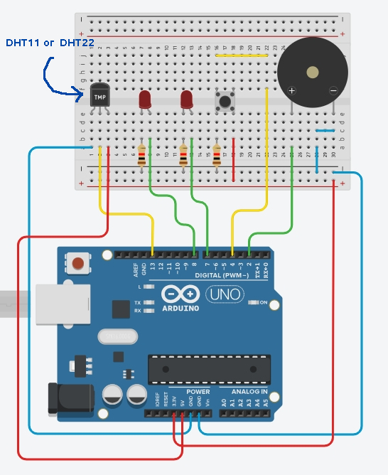

# Non-Blocking Temperature Alarm (Arduino + DHT Sensor)

This project demonstrates how to implement a basic temperature alarm
in arduino that uses non-blocking code to make the interaction with
arduino always responsive.

### Components

1. DHT11 or DHT22 Sensor.
2. 2x LED.
3. 1x Push Button.
4. 3x Resistors (_if your components need it_).
5. 1x Buzzer

### Arduino Schema

### Description

One of the LED will always blink to indicate that the alarm is on,
a user can then press the button to toggle the alarm off/on, if the
alarm is of, there would be no blinking.

If the temperature drop to the min celcsius or exceed the max celcsius,
the buzzer will beep to alert the user.